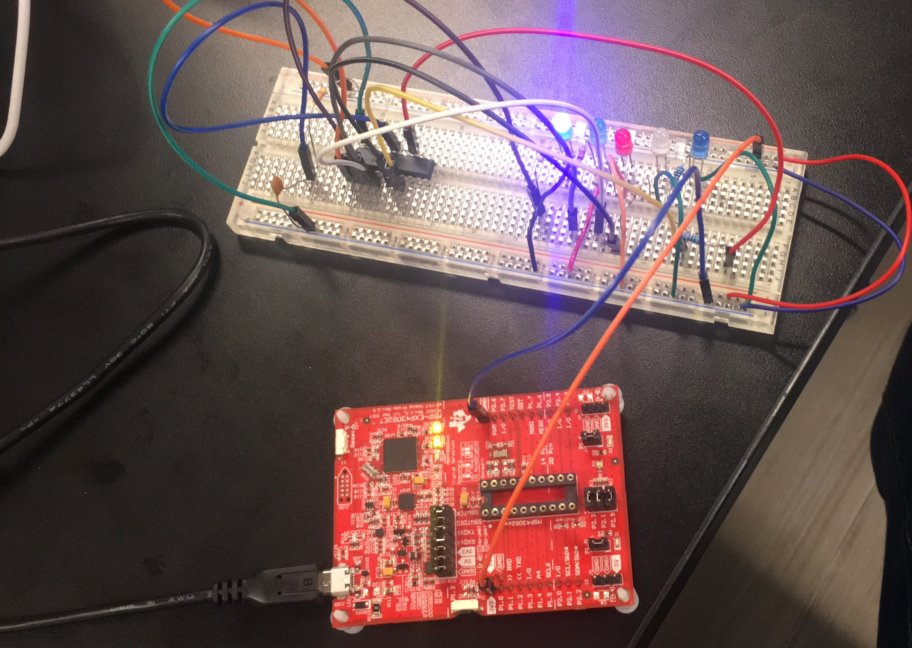

# Off Board Blink
In this part of lab 1 an off board blink method was used to blink couple of LEDs. The **MSP430G2553** microcontroller was first programmed so that it blinks 5 LEDs. The Pins that the LEDs connect to were programmed in such a way that they blink at a different delay. 
The following table shows the port and the pins that were used to connect to the LEDs on the bread board.

||7|6|5|4|3|2|1|0|
|---------|--|--|--|--|--|--|--|--|
|P1 **In**|||||||||
|P1 **OUT**||1/0||1/0||1/0|1/0|1/0|
|P1 **DIR**||1||1||1|1|1|

**Table: Special Function Register for port1**
After the Microprocessor was fully programmed and debugged, It was taken off of the dev board and was placed on a bread board. The dev bord was used as a power supply to the microporcessor that was placed on the bread board. 

## Reset Circuit

 

# LED Blink Off Board

 
# Blink Video Link
[Off Board LED Blink Demo Video](https://youtu.be/MT7xGe_gmbI)

